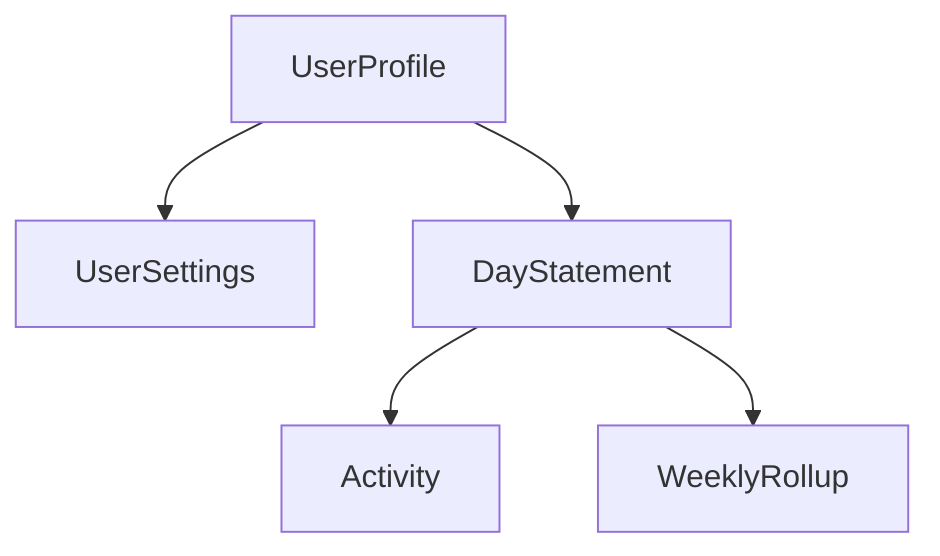

# Tempo User Data + Model Map

## What the current codebase tells us

- The app is currently a SwiftUI iOS app with local models and views. I do not see a backend/API layer in this repo yet.
- `Activity.swift` already exists and stores `id`, `name`, `length`, `category`, and `createdAt`.
- `DayStatement.swift` and `UserSettings.swift` exist but are still empty.
- The real app currently has a launch screen and a partial dashboard.
- The mock screens define the intended product shape much more clearly: daily checkup, hourly rate settings, statement history, past-day ledger, reminders, and profile settings.

## 1. Data you must collect from users

These are the fields that should come from user input, not from calculations.

| Data | Why you need it | Where it comes from | Target model |
| --- | --- | --- | --- |
| `displayName` | Needed for greeting/profile identity | Onboarding or profile edit | `UserProfile` |
| `hourlyRate` | Core number for all statement math | Onboarding or hourly-rate settings | `UserSettings` |
| `activityTitle` | Identifies what the time block was | Checkup / quick add | `Activity` |
| `durationMinutes` | Needed to calculate value movement | Checkup / quick add | `Activity` |
| `activityCategory` | Required to classify value as earned/required/spent | Checkup review before closing | `Activity` |
| `reminderEnabled` | Needed only if you ship reminders | Profile settings | `UserSettings` or `ReminderSettings` |
| `reminderTime` | Needed only if reminders are on | Profile settings | `UserSettings` or `ReminderSettings` |
| `entryDate` | Only needed when user backfills or edits a past day | Manual edit / history flow | `DayStatement` or `Activity` |

## 2. Data you should derive instead of asking for

These values should be computed from existing data so you do not over-collect.

| Derived data | Compute from | Main screen(s) |
| --- | --- | --- |
| `greetingText` | Current local hour | Dashboard |
| `initials` | `displayName` | Profile |
| `entryCount` | `activities.count` | Dashboard |
| `earnedTotal` | Sum of earned activities | Dashboard, Checkup, History |
| `requiredTotal` | Sum of required activities | Dashboard, Checkup, History |
| `spentTotal` | Sum of spent activities | Dashboard, Checkup, History |
| `netTotal` | `earnedTotal - requiredTotal - spentTotal` or signed sum | Dashboard, Checkup, History |
| `activityAmount` | `durationMinutes * hourlyRate * categoryRule` | Checkup, Ledger, History |
| `statementStatus` | Open/closed + uncategorized count | Dashboard, Checkup, History |
| `weeklyRollup` | Aggregate daily statements by week | History |
| `heroSupportText` | Statement status + uncategorized count | Checkup |

## 3. Recommended model files

This is the cleanest first-pass file layout based on the screens already in the repo.

| File | Purpose | Core fields |
| --- | --- | --- |
| `UserProfile.swift` | Identity shown in dashboard/profile | `id`, `displayName`, `createdAt`, `updatedAt` |
| `UserSettings.swift` | User-configurable app/account settings | `userId`, `hourlyRate`, `currencyCode`, `reminderEnabled`, `reminderTime`, `earnedMultiplier`, `requiredMultiplier`, `spentMultiplier`, `updatedAt` |
| `Activity.swift` | One logged block of time | `id`, `statementId`, `title`, `durationMinutes`, `category`, `occurredAt`, `createdAt`, `updatedAt`, `notes?` |
| `DayStatement.swift` | One day-level ledger/closeout | `id`, `userId`, `date`, `status`, `hourlyRateSnapshot`, `earnedTotal`, `requiredTotal`, `spentTotal`, `netTotal`, `entryCount`, `closedAt?`, `templateSourceStatementId?` |
| `WeeklyRollup.swift` | Optional cached archive summary | `id`, `weekStart`, `weekEnd`, `earnedTotal`, `requiredTotal`, `spentTotal`, `netTotal`, `dayCount` |

## 4. Screen-to-model map

| Screen | Reads | Writes |
| --- | --- | --- |
| `LaunchPage` | None | None |
| `DashboardPage` | `UserProfile`, today's `DayStatement`, recent `Activity` rows, `UserSettings.hourlyRate` | Usually read-only |
| `CheckupPage` / mock checkup sheet | Open `DayStatement`, today's `Activity` entries, `UserSettings.hourlyRate`, category multipliers | Creates/updates `Activity`, closes `DayStatement` |
| `HistoryPage` / mock history | Past `DayStatement` records and optional `WeeklyRollup` | Optional filters only |
| `PastDayStatementSheet` | One closed `DayStatement` and its `Activity` children | Usually read-only |
| `ProfilePage` / mock profile | `UserProfile`, `UserSettings` | Updates profile/settings |
| `HourlyRateSheet` | `UserSettings.hourlyRate` | Updates `UserSettings` |

## 5. Relationship map

More accurate in words:

- One user has one profile.
- One user has one settings record.
- One user has many day statements.
- One day statement has many activities.
- One weekly rollup is derived from many day statements.

## 6. Minimum collection set for v1

If you want the smallest possible data model that still supports your current product direction, collect only:

- `displayName`
- `hourlyRate`
- `activityTitle`
- `durationMinutes`
- `activityCategory`

Everything else can be derived or defaulted for a first version.

## 7. Important model decisions before you code

- `ActivityCategories.swift` currently uses `necessity`, while the mock screens consistently use `Required`. Pick one canonical internal name now and keep the UI label separate if needed.
- Store `hourlyRateSnapshot` on each `DayStatement`. Otherwise old history will change every time the user edits their hourly rate.
- Keep `DayStatement` as the parent record and `Activity` as the child record. That matches the dashboard, checkup, and history flows best.
- Treat weekly history as derived data first. You probably do not need users to enter anything for weekly views.
- If reminders stay simple, keep them in `UserSettings`. If they become more advanced later, split them into `ReminderSettings.swift`.

## 8. Missing data in the current repo

Compared with the current models and screens, these are the main missing fields you should probably add.

### Missing user-input data

- `displayName`
- `hourlyRate`
- `reminderEnabled`
- `reminderTime`
- `entryDate` if you want users to log or edit past days
- `requiredMultiplier` only if you want category math to be user-configurable

### Missing stored data that should not be manually entered every time

- `userId` on top-level user-owned records
- `statementId` on each `Activity`
- `occurredAt` on each `Activity`
- `date` on each `DayStatement`
- `status` on each `DayStatement`
- `closedAt` on each `DayStatement`
- `hourlyRateSnapshot` on each `DayStatement`
- `earnedTotal`, `requiredTotal`, `spentTotal`, and `netTotal` snapshots on closed statements

### Data you do not need to collect directly

- `initials`
- `greetingText`
- `entryCount`
- `activityAmount`
- weekly totals and weekly summaries
